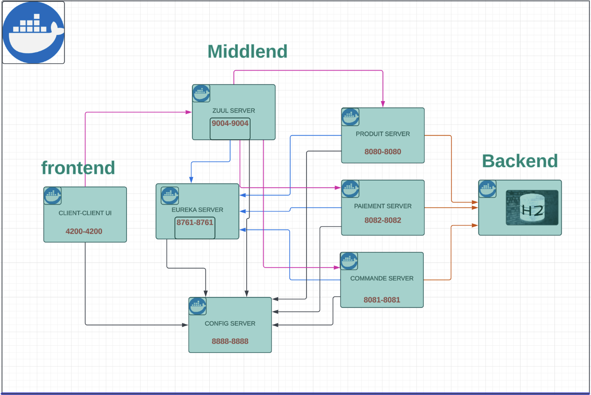

# TP E-commerce
## Auteur

|   |           | 
| :--------------: | :--------------: | 
| Amina JALIDY | Imad Maamri        |
| [@aminajalidy](https://github.com/aminajalidy) | [@Imadm12](https://github.com/Khady71) | 
| amina.jalidy@uphf.fr  | imad.maamri@uphf.fr           | 

---

## Technologies utilisées

Voici les technologies principales utilisées pour ce projet :

- **Angular** : Framework front-end utilisé pour l'interface utilisateur.
- **Java & Spring Boot** : Technologie principale pour le développement des microservices backend.
- **H2 Database** : Base de données en mémoire utilisée pour simplifier le stockage des données.
- **Docker** : Conteneurisation des microservices pour un déploiement et une gestion faciles.
- **Postman** : Outil utilisé pour tester les API REST.
- **Eureka** : Service de découverte pour la gestion des microservices.
- **Zuul** : API Gateway utilisée pour router les requêtes.

---

## Description du projet

Ce projet met en œuvre une architecture de microservices pour une application de e-commerce. L'objectif est de démontrer les avantages de l'architecture distribuée en utilisant des services indépendants et modulaires qui communiquent entre eux via des API REST.

### Objectifs et fonctionnalités

1. **Gestion des Clients** :
    - Microservice permettant de gérer les clients de l'application. Il gère l'inscription, l'authentification et la récupération des informations des clients.
    - **Endpoints disponibles** :
      | Method | Endpoint | Description |
      | :--- | :--- | :--- |
      | `GET` | `/api/clients` | Récupère tous les clients |
      | `POST` | `/api/clients/login` | Authentification des clients |
      | `POST` | `/api/clients/sign-up` | Inscription de nouveaux clients |
    - **Modèle de la base de données** :
        - `Client` : **id**, **login**, **password**

2. **Gestion des Produits** :
    - Microservice pour gérer l'ajout, la récupération et la suppression des produits.
    - **Endpoints disponibles** :
      | Method | Endpoint | Description |
      | :--- | :--- | :--- |
      | `GET` | `/api/produits` | Récupère tous les produits disponibles |
      | `GET` | `/api/produits/:id` | Récupère les détails d'un produit spécifique par son ID |
      | `POST` | `/api/produits/ajouter` | Ajoute un nouveau produit |
      | `DELETE` | `/api/produits/:id` | Supprime un produit par son ID |
    - **Modèle de la base de données** :
        - `Produit` : **id**, **titre**, **description**, **image**, **prix**

3. **Gestion des Commandes** :
    - Microservice permettant de passer et de suivre des commandes pour les produits.
    - **Endpoints disponibles** :
      | Method | Endpoint | Description |
      | :--- | :--- | :--- |
      | `GET` | `/api/commandes` | Récupère toutes les commandes effectuées |
      | `GET` | `/api/commandes/:id` | Récupère les détails d'une commande par ID |
      | `POST` | `/api/commandes/ajouter` | Passe une nouvelle commande |
    - **Modèle de la base de données** :
        - `Commande` : **id**, **productId**, **quantite**, **dateCommande**, **commandePayee**

4. **Système de Paiement** :
    - Microservice de simulation pour traiter les paiements des commandes.
    - **Endpoints disponibles** :
      | Method | Endpoint | Description |
      | :--- | :--- | :--- |
      | `GET` | `/api/paiements` | Récupère tous les paiements réalisés |
      | `POST` | `/api/paiements/ajouter` | Effectue un paiement pour une commande |
    - **Modèle de la base de données** :
        - `Paiement` : **id**, **idCommande**, **montant**, **numeroCarte**

---

## Décentralisation de la configuration

Nous utilisons un serveur de configuration centralisé pour gérer les paramètres des microservices, ce qui permet de :
- **Centraliser la configuration** : Simplifie la gestion des paramètres et permet des mises à jour globales.
- **Améliorer la maintenance** : La séparation des préoccupations rend le code plus modulaire et facile à maintenir.
- **Faciliter les changements** : Les paramètres peuvent être modifiés dynamiquement sans redéployer l'application.


---

## Eureka - Naming Service


Eureka est utilisé comme service de registre pour la découverte des microservices. Cela permet une gestion dynamique des instances et une meilleure résilience du système.


### Avantages d'Eureka
1. **Découverte dynamique des services** : Inscription automatique des services, facilitant la communication inter-services.
2. **Surveillance et supervision** : Vue centralisée de l'état des services et détection rapide des erreurs.
3. **Équilibrage de charge** : Prise en charge de plusieurs instances d'un même service pour une meilleure répartition du trafic.


---

## Zuul Proxy - API Gateway

Zuul Server est une application de passerelle API. Il traite toutes les demandes et effectue le routage dynamique des applications de microservices. Il est également connu sous le nom de serveur Edge. Zuul est conçu pour permettre le routage dynamique, la surveillance, la résilience et la sécurité. Il peut également acheminer les demandes vers plusieurs groupes Amazon Auto Scaling.
Par exemple, /api/produits est mappé vers le service produit et /api/utilisateur est mappé vers le service utilisateur. Le serveur Zuul achemine dynamiquement les demandes vers l'application back-end correspondante.

Traduit avec DeepL.com (version gratuite)
### Avantages de Zuul
1. **Point d'entrée unique** : Simplifie la gestion du trafic en centralisant les requêtes.
2. **Routage dynamique** : Redirige les requêtes vers les services appropriés en fonction des règles configurées.
3. **Sécurité renforcée** : Implémentation de l'authentification et de l'autorisation pour protéger les services.


---

## Architecture globale

Voici un schéma simplifié de l'architecture des microservices.



---

## Étapes pour exécuter le projet

1. **Cloner le projet :**
   ```bash
   git clone https://github.com/jalidyamina/microservices-architecture.git
   cd microservices-architecture
